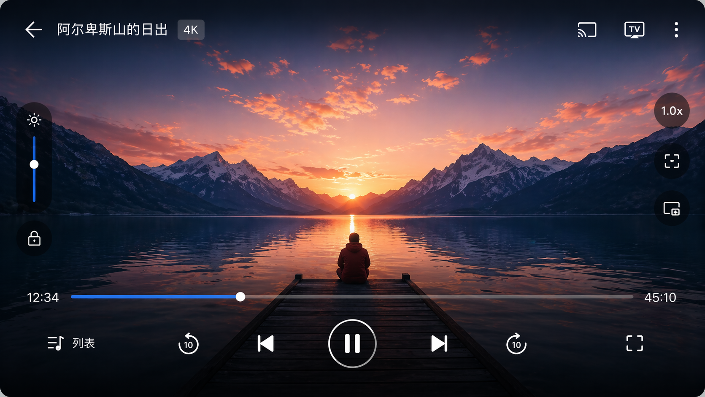
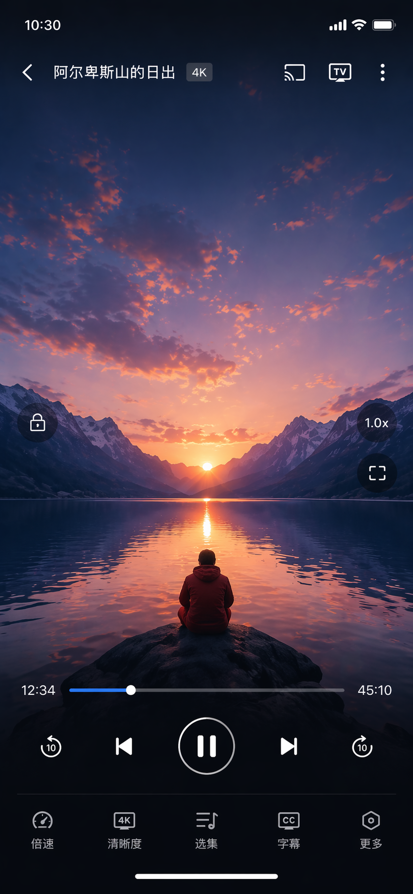

# OpenVideo

**[中文](README.zh-CN.md)**

OpenVideo is a lightweight and easy-to-use Android video player built with Kotlin. It targets modern Android versions and uses Media3 (ExoPlayer) for playback, with a customizable player UI, playlists, history, and local settings.

Problems this project aims to solve:
1. Many video players on the market are bloated or contain too many advertisements.
2. OpenVideo aims to provide a lightweight, clean, and practical alternative.

> [!NOTE]
> This project was developed primarily with the assistance of AI. Code quality, stability, and compatibility are not guaranteed. Please evaluate it carefully before relying on it in important scenarios. If you encounter a bug, please open an issue; I will do my best to investigate and fix it as my personal time allows, but response times cannot be guaranteed.

## Requirements

- Android Studio with AGP 9 support, or the checked-in Gradle wrapper
- JDK 17
- Gradle **9.5**, Android Gradle Plugin **9.0.1**
- Kotlin **2.2.10**, KSP **2.3.7**
- Android SDK **compileSdk 35**, **minSdk 23**

The project uses AGP 9 built-in Kotlin support. KSP generated sources are validated by
the normal debug, unit test, and release build pipeline.

## Build

From the project root:

```bash
./gradlew :app:assembleDebug
```

Windows:

```bat
gradlew.bat :app:assembleDebug
```

Release builds apply R8 minification; ensure signing is configured for your release variant.

## Project layout (overview)

| Path | Role |
|------|------|
| `app/src/main/java/.../ui/` | Activities, fragments, player UI |
| `app/src/main/java/.../core/` | Playback, preferences, database helpers |
| `gradle/libs.versions.toml` | Version catalog for dependencies |

Open-source licenses for bundled libraries are generated at build time (Google OSS Licenses plugin) and can be opened from **Settings → Open source licenses**.

## UI design (reference)

Static mockups in `design/` illustrate the intended player chrome (overlay bars, semi-transparent controls, accent blue progress). These are layout references, not screenshots of the running app.

| Landscape | Portrait |
|-----------|----------|
|  |  |

## Contributing

Issues and pull requests are welcome. Please keep changes focused and match existing code style.

Experienced developers who are interested in jointly maintaining OpenVideo are especially welcome. Please get in touch by opening an issue in this repository.

## License

OpenVideo is released under the MIT License. Third-party library licenses are listed in the in-app **Open source licenses** screen.
