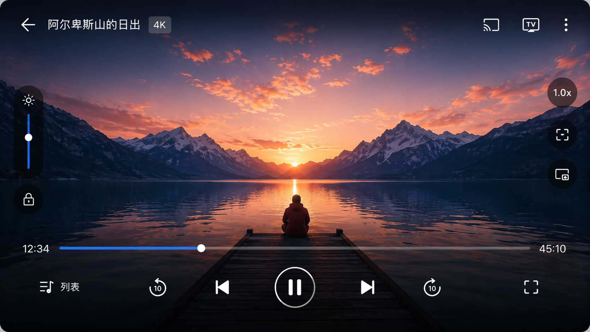
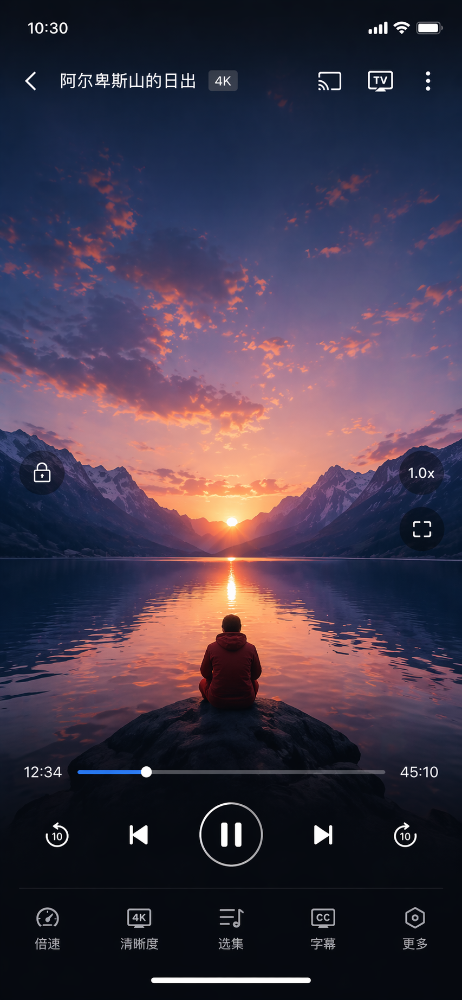

# OpenVideo

**[English](README.md)**

OpenVideo 是一款使用 Kotlin 开发的 Android 视频播放器。面向较新的 Android 版本，采用 Media3（ExoPlayer）作为播放内核，提供可自定义的播放界面、播放列表、播放历史与本地设置等功能。

解决问题:
1. 市面上的播放器能用的丑、不丑的要钱
2. 所以我通过AI撸一个自己喜欢的播放器

## 环境要求

- Android Studio Koala 或更高版本（或兼容的 Gradle / AGP 配置）
- JDK 17
- Android SDK：**compileSdk 35**，**minSdk 23**

## 编译

在项目根目录执行：

```bash
./gradlew :app:assembleDebug
```

Windows：

```bat
gradlew.bat :app:assembleDebug
```

Release 构建会启用 R8 压缩；发布前请自行配置签名。

## 目录结构（概览）

| 路径 | 说明 |
|------|------|
| `app/src/main/java/.../ui/` | 界面：Activity、Fragment、播放器 UI |
| `app/src/main/java/.../core/` | 播放、偏好设置、数据库等 |
| `gradle/libs.versions.toml` | 依赖版本目录 |

第三方开源组件的许可信息在构建时由 Gradle 插件汇总，可在应用内 **设置 → 开源许可** 中查看。

## 界面设计（参考稿）

`design/` 目录下的静态稿用于说明播放器遮罩层的视觉风格（顶栏/底栏、半透明圆形按钮、蓝色进度条等）。以下为横屏与竖屏参考图，不代表运行时截图。

| 横屏 | 竖屏 |
|------|------|
|  |  |

## 参与贡献

欢迎提交 Issue 与 Pull Request；请尽量保持改动范围清晰，并遵循现有代码风格。

## 许可证

OpenVideo 使用 MIT License 发布；各依赖库的具体许可亦可在应用内 **开源许可** 页面查看。
