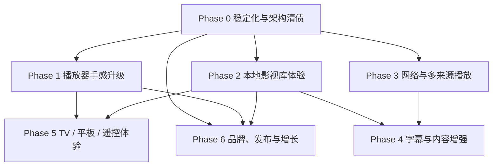

# OpenVideo Phase 开发计划索引

**日期：** 2026-05-17  
**来源：** `docs/roadmap/next-development-plan-2026-05-17.md`  
**用途：** 将总路线图拆成可执行 Phase 目录，便于逐阶段开工、评审、验收和回溯。

---

## 阶段目录

| Phase | 目录 | 主题 | 建议周期 | 目标版本 |
|------|------|------|----------|----------|
| Phase 0 | `phase-0-stability-architecture/` | 稳定化与架构清债 | 1～2 周 | v0.1.0 基线 |
| Phase 1 | `phase-1-player-feel/` | 播放器手感升级 | 2～4 周 | v0.2.0 |
| Phase 2 | `phase-2-media-library/` | 本地影视库体验 | 3～6 周 | v0.3.0 |
| Phase 3 | `phase-3-network-sources/` | 网络与多来源播放 | 4～8 周 | v0.4.0 |
| Phase 4 | `phase-4-subtitles-content/` | 字幕与内容增强 | 3～6 周 | v0.4.x / v0.5.0 |
| Phase 5 | `phase-5-tv-tablet-remote/` | TV / 平板 / 遥控体验 | 4～8 周 | v0.5.x |
| Phase 6 | `phase-6-brand-release-growth/` | 品牌、发布与增长 | 并行推进 | 公开发布版 |

---

## 统一节奏约定

1. **每个 Phase 先开规格评审。** 明确目标、非目标、验收标准、测试矩阵后再开工。
2. **每个 Sprint 控制在 3～5 个可合并切片。** 播放器核心变更优先小步提交，避免一次改动 Activity、数据库、UI、播放器内核过多区域。
3. **每个用户可见切片必须有回归项。** 至少覆盖单元/源码测试、Debug 构建；播放器、通知、字幕、手势需补真机检查清单。
4. **每个 Phase 结束要产出 Release Notes。** 即使暂不发布，也记录面向用户的变化、已知问题和回滚点。
5. **默认不引入账号体系。** 设置备份、媒体库、网络来源都先离线优先，联网能力需显式说明隐私影响。

---

## 依赖关系

---

## 开工优先级建议

1. **先做 Phase 0。** 这是后续所有阶段的风险控制层。
2. **Phase 1 与 Phase 2 可部分并行。** 前提是一个人/分支负责播放器，一个人/分支负责媒体库，避免同时改同一批文件。
3. **Phase 3 不建议早于 Phase 0。** 网络播放会放大错误处理、历史模型、字幕匹配和来源抽象问题。
4. **Phase 6 可持续穿插。** 品牌、教程、隐私说明、发布脚本不应等全部功能完成才做。
